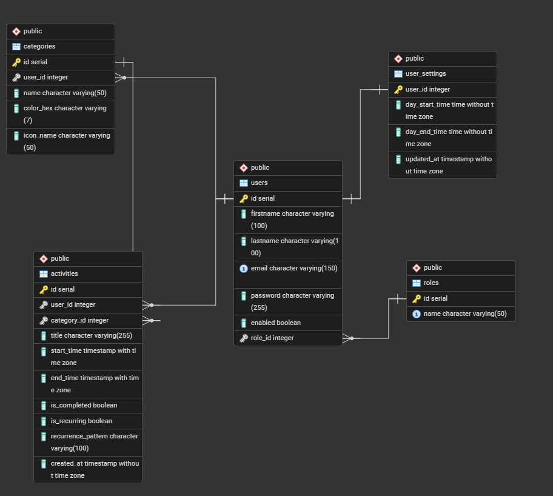

# Activity Helper

A web application designed for time organization and daily activity management. The project was built from scratch using the **MVC (Model-View-Controller)** design pattern, plain PHP, and a PostgreSQL database.

## Technologies

  * **Backend:** PHP
  * **Database:** PostgreSQL
  * **Frontend:** HTML, CSS3, JavaScript
  * **Communication:** Fetch API (AJAX)
  * **Architecture:** MVC Pattern, Custom Routing
  * **Containerization:** Docker

## Features

1.  **User System:**

      * Registration and login (input validation, password hashing).
      * User session management.
      * Secure logout functionality.

2.  **Roles and Permissions:**

      * Role-based access control: **Standard User** and **Admin**.
      * **Admin Panel:** View the system's user list and toggle their roles (implemented asynchronously using vanilla JavaScript and the Fetch API).

3.  **Activity Management (CRUD):**

      * Create new tasks and activities.
      * Assign specific categories to tasks.
      * Visualize tasks through a dedicated calendar and dashboard view.

## Project Structure

```text
/docker
  /db           # Database configuration and initialization scripts (init.sql)
  /nginx        # HTTP server configuration (Nginx)
  /php          # Dockerfile for the PHP environment
/public
  /scripts      # Client-side JavaScript logic
  /styles       # CSS stylesheets
  /views        # Application view templates
/src
  /attribute    # Custom PHP attributes
  /controllers  # Business logic and application controllers
  /middleware   # Request interception and permission verification
  /model        # Domain models and entities
  /repository   # Data access layer for database interactions
config.php      # Database connection configuration file
Database.php    # Core class handling the PostgreSQL connection
docker-compose.yaml # Docker services and container definitions
index.php       # Main application entry point
Routing.php     # Custom URL-to-controller mapping system
```

## Database ERD Diagram


